## {background-color="#FAF9F7" .title-open .nostretch}

::: {.deck-title}
AI on the pediatric ward
:::

::: {.title-sub}
What it can do, where it fails, and how to check it.
:::

::: {.title-meta}
Austin G. Meyer, MD, PhD, MS, MPH, MS, FACP, FAAP
:::

::: {.title-affil}
Assistant Professor, Pediatrics
:::

::: notes
One hour. Two live blocks, four lessons (Labs 1–4): Make → inspect, then Ask → verify. Take-home Labs 5–8 sit after Q&A and are not on the 60-minute clock. No PHI tonight. This is a survey, not a protocol — keep that in your voice, not as a punch on the title slide.
:::

---

## Four questions, then the national numbers {.viz}

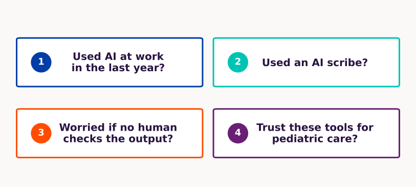{width="100%"}

::: notes
Do this before you show the national bars. Four show-of-hands: used AI at work in the last year; used an AI scribe; worried if no human checks the output; trust these tools for pediatric care. Then advance.
:::

---

## They use AI. Almost none trust it for children. {.viz}

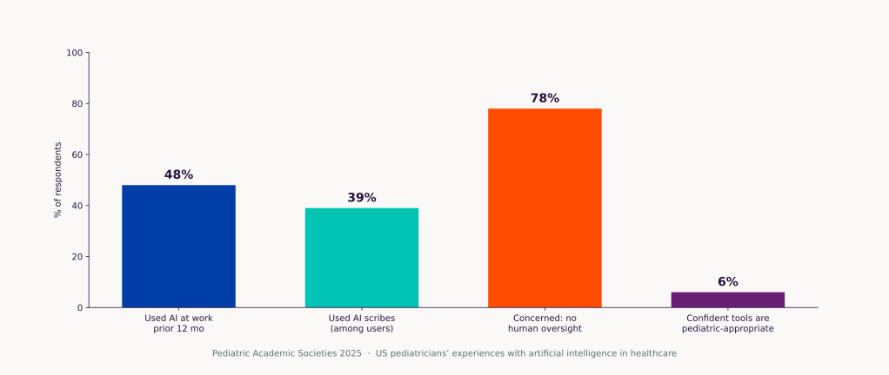{width="100%"}

::: notes
PAS 2025. Punchline is 6%. The room just voted. Point at the gap between “I use it” and “I trust it for children.”
:::

---

## Three ground rules for today.

:::: {.rules-row}
::: {.box .box-orange}
::: {.box-label}
Invented cases
:::

Every demo patient is made up.
:::
::: {.box .box-purple}
::: {.box-label}
No real notes in ChatGPT
:::

Consumer ChatGPT, Claude, Gemini.

No names, record numbers, or pasted notes.
:::
::: {.box .box-teal}
::: {.box-label}
Check before you copy
:::

Do not copy a dose or a citation into a note until you have opened the source.
:::
::::

::: notes
Ground rules for the room, not a numbered manifesto. Verbally repeat one line: “No real patient data in consumer tools.” If someone offers a real H&P, stop and point at card 1. Consumer cloud is the problem. Local models wait for the next slide. Card 3: open the paper or the monograph before a number or a citation hits the note.
:::

---

## Where the prompt goes is the privacy question. {.viz}

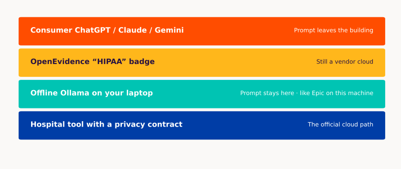{width="100%"}

::: notes
This is the clinically actionable privacy slide. Consumer ChatGPT: the prompt leaves the building. OpenEvidence’s HIPAA badge is still a vendor cloud. Local Ollama: the prompt stays on the laptop they already use for the EHR. That is a reasonable path. Hospital BAA tools are the official cloud path.
:::

---

## Sixty minutes on the clock. Take-home labs sit after Q&A. {.viz}

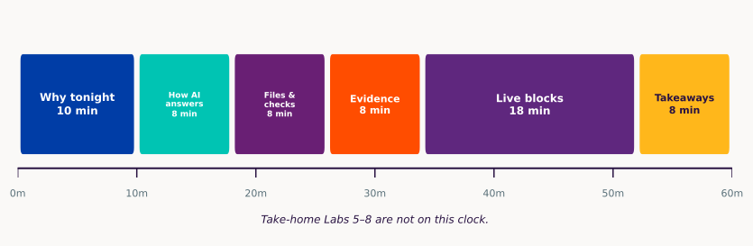{width="100%"}

::: notes
10-8-8-8-18-8. Take-home Labs 5–8 are not on this clock — say that out loud. Q&A eats slack at the end of the hour, after Lab 4. Live work is two blocks containing four lessons: Make → inspect (Labs 1–2), Ask → verify (Labs 3–4).
:::

---

## AI is one word for three jobs. {.viz}

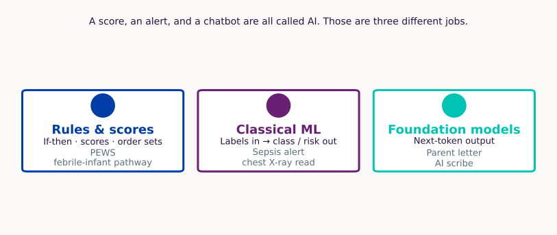{width="100%"}

::: notes
Ask which kind they have already encountered this month. A score, an alert, and a chatbot are all called AI — that sentence is on the canvas. Left box: PEWS and a febrile-infant pathway. Middle: sepsis alert and a chest X-ray read. Right: a parent letter and an AI scribe. FDA does not regulate “AI as such”; it regulates devices by intended use.
:::

---

## Adult accuracy does not travel to the pediatric ward. {.viz}

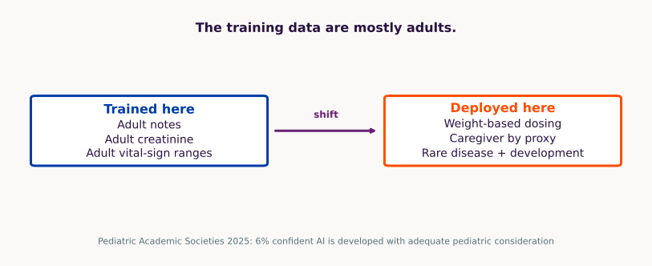{width="100%"}

::: notes
Distribution shift. Vendors often quote AUROC; say adult accuracy so they hear the population, not the metric. The 6% PAS number is a conference abstract. Carry it as a prior, not as a prevalence study.
:::

---

## How AI answers {background-color="#00C4B3" .section-break}

---

## A dose is several tokens, not one number. {.viz}

{width="100%"}

::: notes
A dose is several tokens. That is why numeric hallucination is easy and why “just one number” is not a simple object inside the net. The split on the canvas is a cartoon and varies by model. Say that, then move on.
:::

---

## The model guesses the next token. It is not looking up an answer. {.viz}

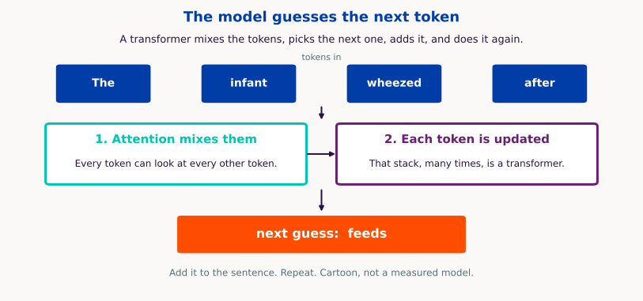{width="100%"}

::: notes
Spoken takeaway: it predicts plausible text; it is not retrieving a stored answer. Decoder-style LLM: given the tokens so far, score the next one, add it, repeat.
:::

---

## The same 38.5 °C is a workup at 3 weeks and often watch-and-treat at 3 years. {.viz}

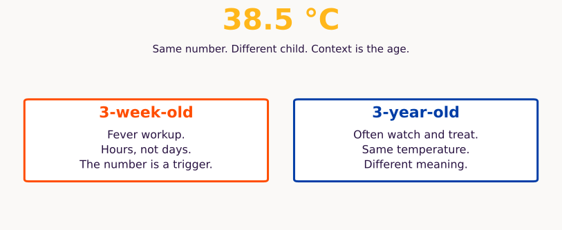{width="100%"}

::: notes
This replaces transformer anatomy. 38.5 °C in a 3-week-old is a workup clock. In a 3-year-old it is often watch-and-treat. Models need that context the same way you do. If they ask how attention works, the backup slide is after Q&A.
:::

---

## Hallucinations changed shape. They are still here. {.viz}

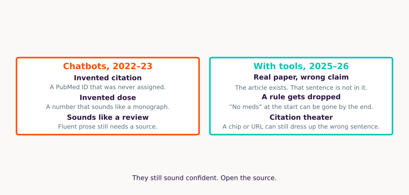{width="100%"}

::: notes
Old: invented PubMed ID. New: real paper, wrong claim; a rule set at the start can vanish mid-run; citation chips that look like proof. This is why citations and tool use do not eliminate checking. Artsi: interpretive error even with real citations.
:::

---

## This week's product name will age. Autocomplete, chat, and tools will not. {.viz}

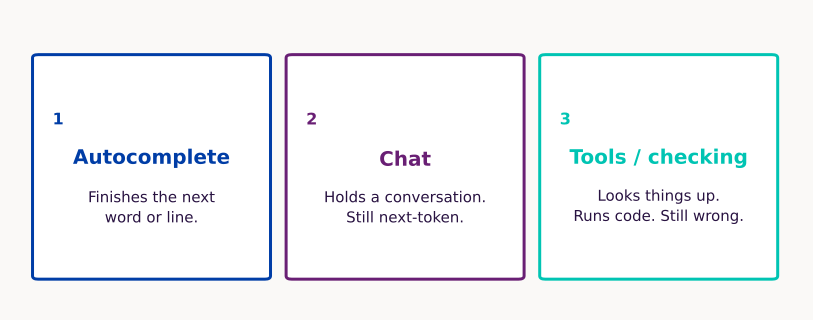{width="100%"}

::: notes
The goal is a taxonomy they can keep when the posters change. Autocomplete → chat → tools/checking. Product names age quickly; these three jobs do not. Tools still look things up and still get it wrong. Full chronology is in backup if someone wants GPT-2 through Fable.
:::

---

## Files and checks {background-color="#691F74" .section-break}

What can the model check before it answers?

---

## RAG looks a corpus up, then writes. Gemini Notebook is the best-known example. {.viz}

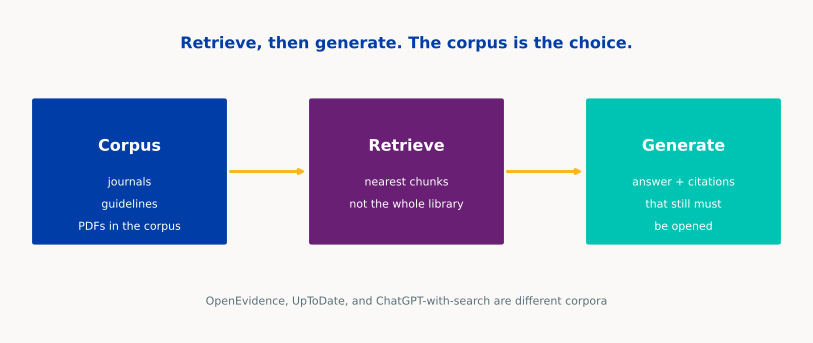{width="100%"}

::: notes
Spell RAG once: retrieval-augmented generation — they have heard the acronym. Point at the corpus card — that is the choice. Gemini Notebook is the best-known example (public PDFs, citation chips). Do not claim a measured market share. OpenEvidence and UpToDate are other corpora. Reduces some hallucinations. Does not stop wrong-paper, unsupported synthesis, leftover parametric claims, or citation theater.
:::

---

## What they call reasoning we might call guess and check. {.viz}

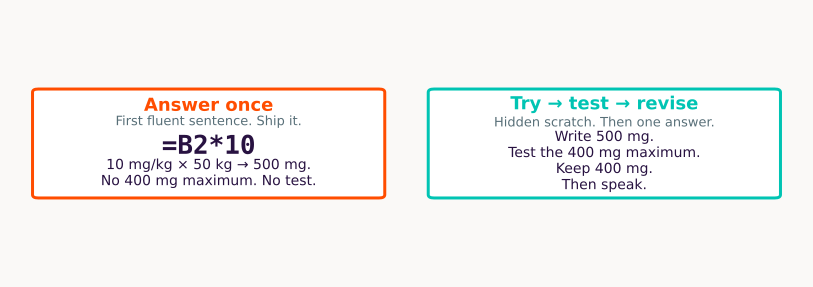{width="100%"}

::: notes
Vendors mean extra tokens before the answer — a try → test → revise loop you usually do not see. We might call it guess and check. Left is the 2023 chatbot: first fluent sentence, ship it. Right is o1-class: hidden scratch work, a checker, then one answer. The toy is a 10 mg/kg dose that needs a 400 mg maximum: 50 kg × 10 = 500, which fails the maximum, so the revised answer is 400 mg. That is why coding evals moved — a formula can fail. A febrile infant is a worse fit. Do not turn this into Lab 2. Files and tools are the next slide. o1 Sep 2024; DeepSeek-R1 Jan 2025 if someone asks whether it was OpenAI-only.
:::

---

## A chatbot returns a paragraph. A harness returns a file. {.viz}

{width="100%"}

::: notes
Ask: which row produces something another person can inspect tomorrow? Top row is a chatbot: prompt in, a paragraph out, you copy it. Bottom row is a harness: prompt, files, tools, an artifact you can open. Cursor, Codex, Claude Code, OpenCode: same genus. Labs 1 and 2 only make sense if the file is the product.
:::

---

## A high exam score does not translate to clinical uncertainty in real situations. That context is almost impossible to train on directly. {.viz}

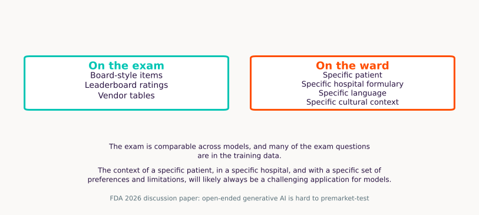{width="100%"}

::: notes
Board-style exams and vendor tables are a test with a key, comparable across models. A real case has clinical uncertainty, a local formulary, and a family’s language — and that context is almost impossible to train on directly. High scores do not travel to weight-based dosing. FDA 2026 paper is still asking how to test open-ended generative AI.
:::

---

## Evidence {background-color="#FF4D00" .section-break}

---

## Only a hospital cloud or this laptop is plausible for real notes. {.viz}

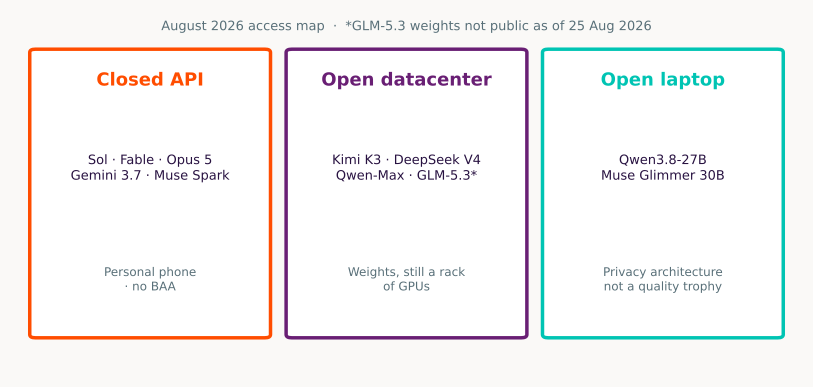{width="100%"}

::: notes
Three places a prompt can live. The title is the takeaway: consumer ChatGPT, Claude, and Gemini send the prompt off-site with no hospital privacy contract. Hospital tool with a business associate agreement is the official cloud path. Laptop Ollama: the vendor never sees the prompt, and they already use that laptop for the EHR. Do not recatalog model names.
:::

---

## OpenEvidence is a search assistant, not a pediatric guideline. {.viz}

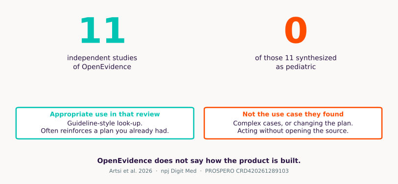{width="100%"}

::: notes
Artsi 2026 OpenEvidence systematic review. 11 studies, none synthesized as pediatric. The appropriate use they found is guideline-style look-up; it often reinforces rather than changes a plan, and is weaker on complex cases. Not for acting without opening the source. End on: search assistant, not pediatric guideline. Company “40% of US physicians” is vendor-reported. Registry: PROSPERO CRD420261289103. Do not invent a pediatric evidence base from 11 adult-leaning studies.
:::

---

## A real citation can still be the wrong answer. {.viz}

{width="100%"}

::: notes
Hajj inside Artsi: same 15 adult transcatheter tricuspid questions. Bars are the share scored fully accurate by the study’s own definition: ChatGPT-4o 10 of 15 (66.7%) vs OpenEvidence 4 of 15 (26.7%). n=15 is the whole study — gray footer, not a headline. OpenEvidence still cited papers; those citations did not make the answers correct. Do not present it as pediatric. Heuristic: OE for journals, UpToDate for the editorial corpus you already pay for, neither for “what do I do without looking.”
:::

---

## Authorship and judgment are decided. Pediatric bedside rules are not. {.viz}

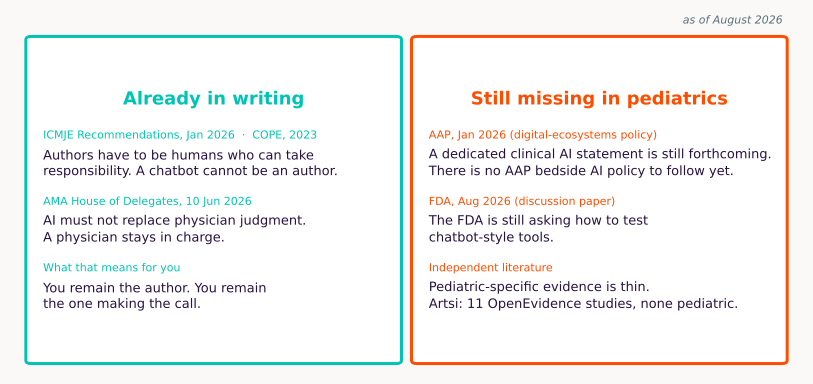{width="100%"}

::: notes
Goal of the slide: what already binds them versus what is still open — not a pediatric protocol. As of August 2026. Settled because journals and the AMA already named the human: ICMJE Jan 2026 and COPE 2023, humans accountable, chatbots cannot be authors; AMA House of Delegates 10 Jun 2026, AI must not replace physician judgment. Unsettled because AAP Jan 2026 digital-ecosystems policy still says a dedicated clinical AI statement is forthcoming; FDA Aug 2026 discussion paper is still asking how to test open-ended generative tools; pediatric-specific evidence is thin (Artsi 11 OpenEvidence studies, none synthesized as pediatric). Do not invent an AAP clinical AI guideline. The dated chronology is in backup.
:::

---

## Live blocks {background-color="#5F277E" .section-break}

---

## Two live blocks, four lessons — not four separate shows. {.viz}

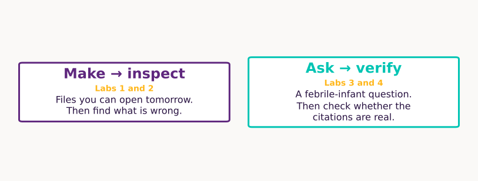{width="100%"}

::: notes
Four lessons, two context switches. Make → inspect is Labs 1 and 2 in one Cursor stretch. Ask → verify is Labs 3 and 4 in the browser. Take-home 5–8 live after Q&A as an appendix; point at the handout, do not run them. Recurring ritual: before each demo, the room predicts what will fail. After, one resident names the check they would perform.
:::

---

## Lab 1 — files, not paragraphs {.nostretch}

::: {.kicker}
Make → inspect · Cursor
:::

:::: {.lab-split}
::: {.box .box-purple .box-prose}
::: {.box-label}
STEM.md — we wrote this
:::

6-month-old former 36-week infant, day 2 of RSV bronchiolitis. SpO2 nadir 88% on room air, now 94% on 0.5 L NC. Taking 50% of feeds. Family wants a plain-language update. Night team wants a wean tracker.
:::
::: {.file-trio}
::: {.box .box-teal}
::: {.box-label}
family_update.docx
:::

Plain-language letter
:::
::: {.box .box-orange}
::: {.box-label}
oxygen_wean_tracker.xlsx
:::

No medication column
:::
::: {.box .box-blue}
::: {.box-label}
noon_conference.pptx
:::

Citations not yet verified
:::
:::
::::

::: {.predict-strip}
Before: what will fail? · After: name one check.
:::

::: notes
Full prompt, already on the clipboard: Read STEM.md. Create family_update.docx, oxygen_wean_tracker.xlsx, noon_conference.pptx from that stem only. No identifiers. No medication column. No invented PubMed IDs. End the letter with “this is a teaching example.” Predict first: a paragraph instead of files, a meds column, an invented PMID. Then paste. Open the three files. One resident names the check. At home: python slides/workshops/lab1_fallback.py. Optional sting: same stem in ChatGPT, “add a dexamethasone dose.”
:::

---

## Lab 2 — spot the bug {.stack-viz .nostretch}

::: {.kicker}
Make → inspect · same Cursor window
:::

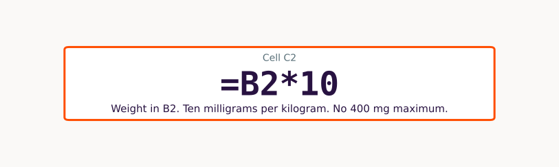{width="88%"}

::: {.predict-strip}
Before: what will fail? · After: name one check.
:::

::: notes
Do not show the error list on the projector first. KEY.md is in the folder: teachicillin, oral, 10 mg/kg/dose every 8 hours, max 400 mg/dose; weight under 2 kg → TOO_SMALL; age is recorded and does not change the dose. Paste: Read KEY.md. Create dosing.xlsx from those rules only. If KEY.md is silent, write CHECK_KEY. Add a README. Room predicts. Then flip to formula view. Hunt: missing max, mg vs mcg, adult default, invented frequency. Fallback python slides/workshops/lab2_fallback.py omits the 400 mg maximum on purpose.
:::

---

## Lab 3 — one question, three corpora {.nostretch}

::: {.kicker}
Ask → verify · browser
:::

::: {.lab-prompt}
Previously healthy 3-week-old, 38.5 °C, well-appearing. Current AAP guidance on lumbar puncture? Quote the document. If you cannot quote, say so.
:::

:::: {.lab-arms}
::: {.box .box-orange .box-prose}
::: {.box-label}
A · ChatGPT
:::

Search **off**. Parameters only. Demand a PMID. Try to open it.
:::
::: {.box .box-purple .box-prose}
::: {.box-label}
B · Gemini Notebook
:::

One public AAP or CDC PDF you uploaded. Require a quote. Click the chip.
:::
::: {.box .box-teal .box-prose}
::: {.box-label}
C · OpenEvidence
:::

Licensed journals, if your NPI works. Click through. If blocked, B is enough.
:::
::::

:::: {.scorecard}
::: {.box .box-blue}
::: {.box-label}
Quoted?
:::
:::
::: {.box .box-teal}
::: {.box-label}
Clickable?
:::
:::
::: {.box .box-purple}
::: {.box-label}
Pediatric?
:::
:::
::: {.box .box-orange}
::: {.box-label}
Asked for missing data?
:::
:::
::: {.box .box-gold}
::: {.box-label}
Would I act?
:::
:::
::::

::: {.predict-strip}
Before: what will fail? · After: name one check.
:::

::: notes
The stem is deliberately missing urinalysis and inflammatory markers. That is the test — do not fill them in. Whiteboard now includes “Did it ask for missing data?” Arm A often mashups febrile-infant algorithms and never asks. If OpenEvidence is blocked, skip C without apology. Stay in the browser for Labs 3 and 4.
:::

---

## Lab 4 — citation autopsy {.nostretch}

::: {.kicker}
Ask → verify · same ChatGPT tab, search still off
:::

::: {.lab-prompt}
Eight Vancouver-style references on high-flow vs CPAP for bronchiolitis, 2018–2026. Include PubMed IDs.
:::

::: {.lab-steps}
1. Open PubMed.
2. Search the first three IDs only.
3. Mark each: exists / exists but the wrong paper / does not exist.
4. Stop. Do not chase all eight.
:::

::: {.predict-strip}
Before: what will fail? · After: name one check.
:::

::: notes
Stochastic. Keep a frozen rehearsal output on the USB. If the live model refuses, or all three IDs are valid, say “good behavior today” and inspect the saved example. Do not invent PubMed IDs to force a miss. One dead or mismatched identifier is the teaching point. Then stop. Do not run Labs 5–8 live. Summary and Q&A are next; take-home is after questions.
:::

---

## Six checks to leave with. Not a protocol. {.viz}

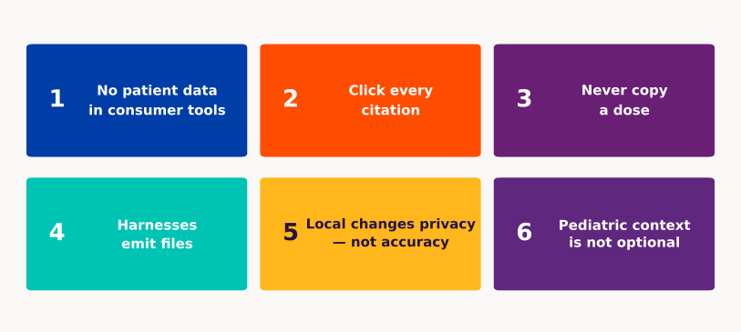{width="100%"}

::: notes
Repeat. Point at the briefing packet and workshops.md. Local changes privacy, not accuracy — that is the laptop story, not a quality claim. Pediatric context is not optional — do not invent an AAP clinical AI policy to fill the last box.
:::

---

## Three questions before you copy. {.qa-close .nostretch}

:::: {.qa-three}
::: {.box .box-orange}
::: {.box-label}
Where did the prompt go?
:::
:::
::: {.box .box-purple}
::: {.box-label}
What source did it use?
:::
:::
::: {.box .box-teal}
::: {.box-label}
What did I verify?
:::
:::
::::

::: {.qa-ask}
Questions
:::

::: notes
Stop here for the live hour. Do not invent an AAP clinical AI guideline in Q&A. Packet is briefing/; presenter-kit is slides/presenter-kit.md. Appendix is take-home Labs 5–8, then backup. Linear deck: you can leave the rest unshown.
:::

---

## Take-home labs {background-color="#00C4B3" .section-break}

After the hour. Recipes in the handout.

---

## Lab 5 — journal club on a URL {.stack-viz .nostretch}

::: {.kicker}
Take-home · 5 of 8
:::

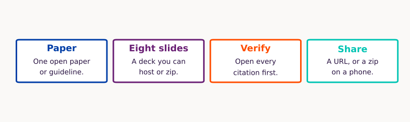{width="100%"}

::: notes
Do not run live. Visible lesson is the four-step flow. Full recipe is in briefing/workshops.md: PAPER.md → eight Reveal slides in docs/index.html → verify citations → GitHub Pages or a local zip. Do not enable Pages until citations are verified. Lab 5 is a resident journal-club fork, not this repo’s docs/.
:::

---

## Lab 6 — local model, airplane mode {.stack-viz .nostretch}

::: {.kicker}
Take-home · 6 of 8
:::

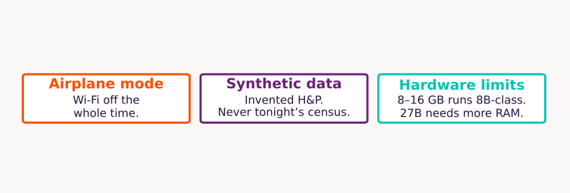{width="100%"}

::: notes
Slide is the constraints. Commands live in the written recipe: ollama.com, ollama pull qwen3.8 or qwen3:8b if memory is tight. 8–16 GB laptop: 8B-class, slowly. 24–32 GB box: Qwen3.8-27B, Muse Glimmer 30B, or Gemma 4 31B (4-bit ~17.5 GB). Synthetic H&P only. Hardware figure is in backup.
:::

---

## Lab 7 — harness loop vs chatbot {.nostretch}

::: {.kicker}
Take-home · 7 of 8 · files vs a paragraph
:::

::: {.lab-goal}
Same request in ChatGPT and in a harness. The product you want is the loop (files, tools, a check), not the chat box.
:::

::: {.lab-prompt}
In an empty folder, create a single `index.html` that plots synthetic noon-conference attendance for eight weeks of residency (made-up counts, not real people). Let me type a week number to highlight that bar. No external APIs. Then confirm the file opens.
:::

::: {.lab-steps}
1. **Arm A · ChatGPT.** Paste the request. Try to copy files by hand.
2. **Arm B · harness.** Cursor, Codex, Claude Code, or OpenCode in an empty folder. Same request. Let it write and open the file.
:::

::: notes
Nonclinical on purpose. Do not ship a fake pediatric growth z-score that someone could reuse. Full recipe in the handout. Paid Cursor is optional; OpenCode + a local model is the free echo.
:::

---

## Lab 8 — source-grounded notebook {.nostretch}

::: {.kicker}
Take-home · 8 of 8 · public PDFs
:::

::: {.lab-goal}
Grounded Q&A over files you chose. Right tool for journal club and policy. Wrong tool for the census.
:::

::: {.lab-steps}
Upload public papers only. Ask something in the corpus. Ask something outside it — it should refuse. Click every citation chip.
:::

::: notes
NotebookLM was renamed Gemini Notebook (16 Jul 2026); that rename belongs in the handout, not as the punch. Public papers only. Do not upload real notes.
:::

---

## Backup {background-color="#281241" .section-break}

If someone asks. Not on the clock.

---

## Three ways a model is taught: labels, structure, or a score. {.viz}

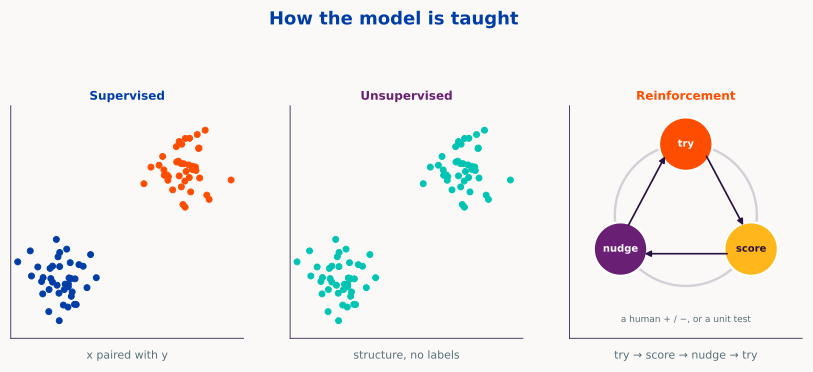{width="100%"}

::: notes
Forty-five seconds if you use it at all. Supervised: x goes with y. Unsupervised: structure, no labels. Reinforcement is a roundabout: try, get scored, nudge, try again. Unlikely to change what they do tomorrow.
:::

---

## Attention is the mix step before the next-token guess. {.viz}

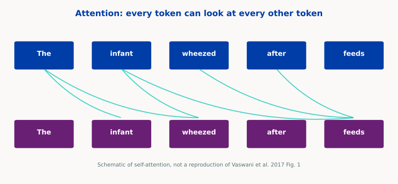{width="100%"}

::: notes
Self-attention, 2017. One token looking at the sentence. The live hour uses the 38.5 °C age example instead.
:::

---

## ChatGPT was the public rupture. o1 made thinking time a product. {.viz}

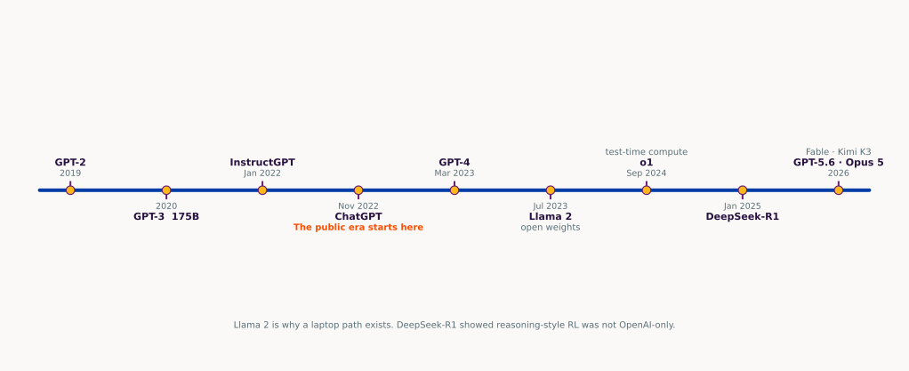{width="100%"}

::: notes
Full chronology. GPT-2 unsupervised. GPT-3 in-context. InstructGPT RLHF. ChatGPT Nov 2022 is the public rupture. Llama 2 is why a laptop path exists. o1 Sep 2024 is test-time compute as a product. DeepSeek-R1 Jan 2025 showed reasoning-style RL was not OpenAI-only. 2026 names are access classes, not Elo to memorize.
:::

---

## Headline parameter counts are not a quality score. {.viz}

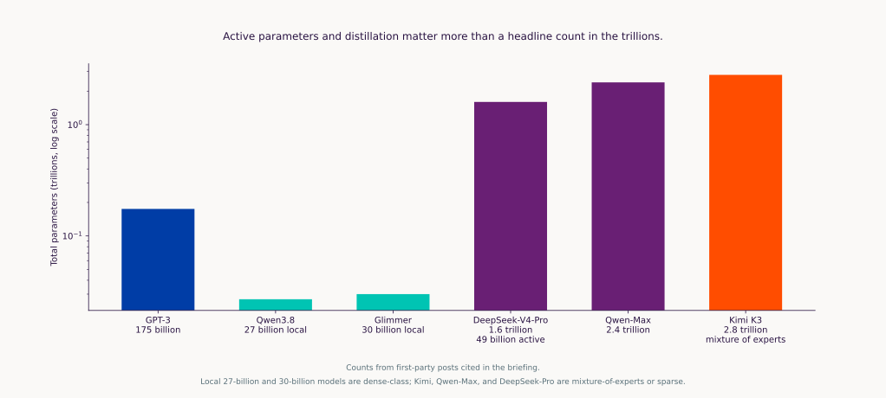{width="100%"}

::: notes
Parameter counts do not help a resident decide whether to trust an answer. Mixture-of-experts vs dense. Laptop 27-billion and 30-billion models vs trillion-parameter datacenter models. Do not treat the y-axis as quality.
:::

---

## Local models need memory your laptop may not have. {.viz .stack-viz}

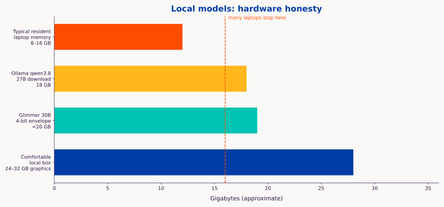{width="100%"}

::: {.viz-links}
[Ollama](https://ollama.com){target="_blank"} · [Hugging Face models](https://huggingface.co/models){target="_blank"}
:::

::: notes
Use with Lab 6 if someone asks. Ollama qwen3.8 18 GB. Glimmer <20 GB 4-bit. 8–16 GB laptops run 8B-class, slowly. The 12 GB bar is the midpoint of that class.
:::

---

## Judge the claims, not the fluency. {.nostretch}

::: {.copy-block}
**Judge the claims, data, code, and citations—not the fluency or confession.**

ICMJE and *Pediatrics* still ask authors to name the tool. Naming it does not make the science more true.
:::

::: notes
One-line backup, not a second lecture. An adult creatinine in a pediatrics manuscript is a scientific failure, not a missing disclosure checkbox.
:::

---

## 2026 statements with a public citation, on one line. {.viz}

::: {.kicker}
as of August 2026
:::

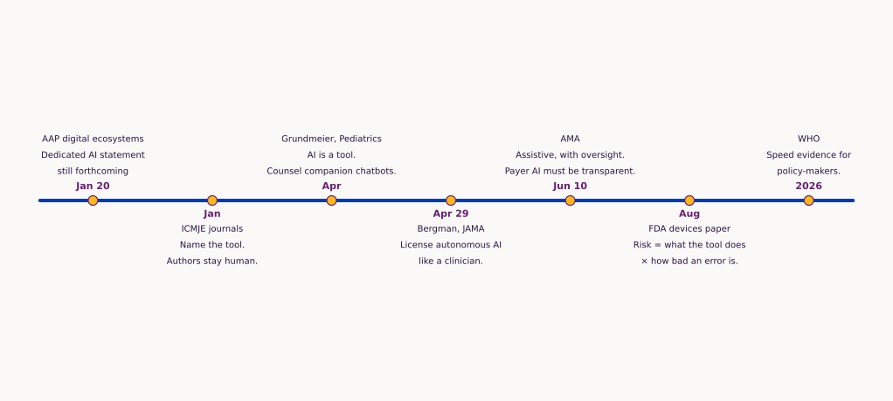{width="100%"}

::: notes
Walk left to right only if someone asks for names. AAP January: digital-ecosystems policy; the dedicated AI statement is still forthcoming — do not invent one. ICMJE January: name the tool; humans stay accountable. Grundmeier April is a CHOP state-of-the-art review. Bergman JAMA Viewpoint is opinion, not a statute. AMA 10 June: assistive, transparency when models change. FDA August: discussion paper, two-axis risk. WHO B09667: evidence-informed policy for policy-makers, not a pediatric practice guideline.
:::
