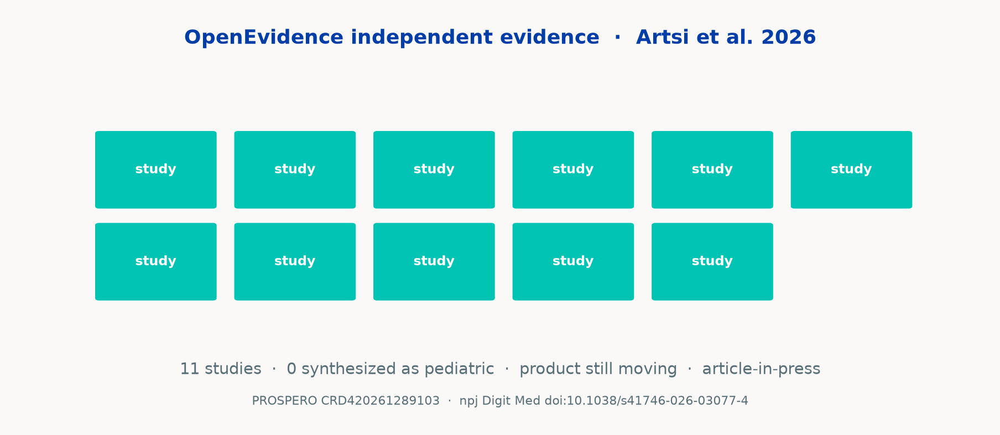

---
format:
  revealjs:
    theme: [simple, mclane.scss]
    slide-level: 2
    slide-number: c/t
    show-slide-number: all
    hash-type: number
    width: 1280
    height: 720
    margin: 0.05
    logo: assets/mclane-train.svg
    footer: "McLane Children's · not clinical guidance · sources in briefing/"
    embed-resources: true
    navigation-mode: linear
    controls-tutorial: false
    preview-links: false
    chalkboard: false
    progress: true
    html-math-method: katex
    code-overflow: wrap
    fig-align: center
---

## {background-color="#FAF9F7"}

{width="70%"}

::: {.kicker}
Pediatric residency workshop-lecture · Temple
:::

::: {.deck-title}
A survey of modern AI
:::

**Not a protocol. Not patient-specific direction.**

Cutoff 25 August 2026 · written briefing in `briefing/`

::: notes
Open on the train. This is McLane's mark from the hospital site, not clip-art. Say: one hour, two live labs, a written briefing for everything we skip. No PHI tonight.
:::

---

## The room rules

:::: {.columns}
::: {.column width="48%"}
{width="70%"}
:::
::: {.column width="52%"}
::: {.caution}
**Synthetic only**

No tonight's patients.

No consumer ChatGPT with PHI.

No copying a dose or a PMID you have not opened.
:::
:::
::::

::: notes
Five non-negotiables from the briefing. The train is a reminder they are in a children's hospital: cute is not a safety control.
:::

---

## The live hour {.viz}

{width="100%"}

::: notes
12-10-10-8-8-12. Q&A eats slack. Handout has six more workshops. Do not read the 40-page packet.
:::

---

## Foundations {background-color="#003DA6" .section-break}

12 minutes

---

## Same word. Three jobs. {.viz}

{width="100%"}

::: notes
Rules / classical ML / foundation models. FDA does not regulate "AI as such"; it regulates devices by intended use.
:::

---

## How the model is taught {.viz}

{width="100%"}

::: notes
Supervised: labels. Unsupervised: structure. RL: reward. LLMs are mostly self-supervised pretraining plus later alignment. Pediatric labels are often billing codes, not truth.
:::

---

## Adult AUROC, pediatric ward {.viz}

{width="100%"}

::: notes
Distribution shift. The 6% PAS number is a conference abstract. Carry it as a prior, not as a prevalence study.
:::

---

## Tokens, not letters {.viz}

{width="100%"}

::: notes
A dose is several tokens. That is why numeric hallucination is easy and why "just one number" is not a simple object inside the net.
:::

---

## Attention {.viz}

{width="100%"}

::: notes
Self-attention, 2017. Original schematic — not Vaswani Figure 1. Point: context, not magic understanding. Then Transformers + scale + data.
:::

---

## Timeline {background-color="#00C4B3" .section-break}

10 minutes

---

## How we got here {.viz}

{width="100%"}

::: notes
GPT-2 unsupervised. GPT-3 in-context. InstructGPT RLHF. ChatGPT 30 Nov 2022 is the public rupture. GPT-4 multimodal. o1 Sep 2024 is test-time compute as a product. 2026 names are access classes, not Elo to memorize.
:::

---

## Size is not the whole story {.viz}

{width="100%"}

::: notes
MoE vs dense. Laptop 27B/30B vs trillion-parameter datacenter models. Counts from first-party posts in the briefing. Do not treat the y-axis as quality.
:::

---

## Reasoning and tools {background-color="#691F74" .section-break}

10 minutes

---

## RAG is a corpus choice {.viz}

{width="100%"}

::: notes
Retrieve then generate. Reduces some hallucinations. Does not stop wrong-paper, unsupported synthesis, leftover parametric claims, or citation theater.
:::

---

## Hallucinations changed shape {.viz}

{width="100%"}

::: notes
Old: invented PMID. New: real paper, wrong claim; harness amnesia. Artsi: interpretive error even with real citations.
:::

---

## "Reasoning" {.viz}

{width="100%"}

::: notes
Schematic. o1: RL on chain of thought plus test-time compute. Coding evals moved because you can check code. That pulled computer-use and harnesses.
:::

---

## Chat vs harness {.viz}

{width="100%"}

::: notes
MCP, skills, orchestration — one slide of vocabulary: USB-C to tools, reusable folders of instructions plus code, a loop that writes files. Tonight's face is Cursor. Codex is the same genus.
:::

---

## The exam is not the ward {.viz}

{width="100%"}

::: notes
MedQA ≠ this infant. Vendor tables stay vendor-reported. FDA 2026 paper is still asking how to test open-ended GenAI. Not guidance.
:::

---

## Frontier and privacy {background-color="#FF4D00" .section-break}

8 minutes

---

## Three boxes, August 2026 {.viz}

{width="100%"}

::: notes
Phone = closed API, no BAA. Hospital EHR someday = governed box 1. Laptop = box 3. GLM-5.3 weights not public as of 25 Aug 2026. Mythos is restricted — do not tell them to just use it.
:::

---

## 11 studies. Zero pediatric. {.viz}

{width="100%"}

::: notes
Artsi 2026 OpenEvidence SR. Click citations. Reinforces rather than changes decisions. Company "40% of US physicians" is not audited.
:::

---

## Grounding ≠ accuracy {.viz}

{width="100%"}

::: notes
Hajj inside Artsi: ChatGPT-4o 66.7 vs OE 26.7 on 15 tricuspid questions. Do not over-read. Heuristic: OE for journals, UpToDate for the editorial corpus you already pay for, neither for "what do I do without looking."
:::

---

## Your ThinkPad is not a Studio {.viz}

{width="100%"}

::: notes
Ollama qwen3.8 18 GB. Glimmer <20 GB 4-bit. 8–16 GB laptops run 8B-class, slowly. Local removes a vendor, not the Security Rule.
:::

---

## HIPAA is not a vibe {.viz}

{width="100%"}

::: notes
Tighten the planning prompt. Consumer tools: no BAA. OpenEvidence badge is vendor. Offline Ollama: stolen laptop. Only hospital tools with an executed BAA for real notes.
:::

---

## Policy {background-color="#691F74" .section-break}

8 minutes

---

## They are already using it {.viz}

{width="100%"}

::: notes
PAS 2025 abstract. Punchline is 6%. Conference abstract, not a paper.
:::

---

## 2026, on a line {.viz}

{width="100%"}

::: notes
AAP digital ecosystems defers dedicated AI policy. Grundmeier April 2026 is a CHOP SOTA review — AI is not a friend — not AAP policy. Bergman Viewpoint, licensure, not law. AMA 10 June 2026: assistive, payer transparency. FDA August discussion paper, comments docket, not guidance; sore-throat child vs chest-pain ED. WHO B09667 is EIP, not bedside.
:::

---

## Journals still police disclosure, not agents

::: {.columns}
::: {.column width="50%"}
::: {.box}
**Required today**

Name the tool.

No chatbot authors.

You are accountable.
:::
:::
::: {.column width="50%"}
::: {.box}
**Still missing**

Prompts / logs / hashes.

Pediatric attestment.

Harnesses that emit spreadsheets.
:::
:::
::::

::: notes
ICMJE / Pediatrics / COPE. Gap: 2023 language still sounds like chatbots. AMA payer policy is the rare one about power. Until AAP's AI statement exists, do not quote Twitter as policy.
:::

---

## Live labs {background-color="#5F277E" .section-break}

12 minutes

---

## Tonight vs take-home {.viz}

{width="100%"}

::: notes
W1 + W4. Cursor for W1. Three browser tabs for W4. Fallback Python if the agent dies. Residents watch; free paths are in the handout.
:::

---

## Lab 1 — files, not paragraphs

::: {.kicker}
Cursor agent · empty folder · STEM.md already written
:::

```text
Read STEM.md.
Create family_update.docx, oxygen_wean_tracker.xlsx,
noon_conference.pptx from that stem only.
No identifiers. No medication column. No invented PMIDs.
```

If the agent hangs: `python slides/workshops/w1_fallback.py`

::: notes
Leave this slide up. Paste the prompt. Open the three files. Sting: chatbot "add dexamethasone dose." Spreadsheet has no meds on purpose. Codex is not required.
:::

---

## Lab 4 — one question, three corpora

::: {.kicker}
No harness. Three browsers.
:::

> Previously healthy 8-week-old, 38.5 °C, well-appearing. Current AAP guidance on LP? **Quote the document.** If you cannot quote, say so.

| A | B | C |
|---|---|---|
| ChatGPT, search **off** | Gemini Notebook + one public PDF | OpenEvidence, if NPI works |

Whiteboard: quoted? clickable? pediatric? would I act?

::: notes
Arm A often mashups febrile-infant algorithms. Click every chip. If OpenEvidence is blocked, B is enough.
:::

---

## Six things to leave with {.viz}

{width="100%"}

::: notes
Repeat. Point at the briefing packet and workshops.md. Pocket card is in the briefing appendix if you printed it.
:::

---

## Questions {background-color="#003DA6" .section-break}

:::: {.columns}
::: {.column width="42%"}
{width="100%"}
:::
::: {.column width="58%"}
The packet is the source of truth.

`briefing/` · `slides/presenter-kit.md`

Train mark © BSW / McLane Children's — internal teaching use.
:::
::::

::: notes
Stop. Do not invent an AAP clinical AI guideline in Q&A.
:::
