---
format:
  revealjs:
    theme: [simple, mclane.scss]
    slide-level: 2
    slide-number: c/t
    show-slide-number: all
    hash-type: number
    width: 1280
    height: 720
    margin: 0.05
    logo: assets/mclane-train.svg
    footer: "BSW McLane Children's"
    embed-resources: true
    navigation-mode: linear
    controls-tutorial: false
    preview-links: false
    chalkboard: false
    progress: true
    html-math-method: katex
    code-overflow: wrap
    fig-align: center
---

## {background-color="#FAF9F7" .title-open .nostretch}

{.title-wordmark}

::: {.kicker}
Pediatric residency workshop-lecture · Temple
:::

::: {.deck-title}
A survey of modern AI
:::

Teaching survey · invented cases

::: notes
Open on the train. This is McLane's mark from the hospital site, not clip-art. Say: one hour, two live labs, a written briefing for everything we skip. No PHI tonight. This is a survey, not a protocol and not patient-specific direction — keep that in your voice, not as a punch on the title slide.
:::

---

## How we work today

:::: {.rules-row}
::: {.box .box-orange}
::: {.box-label}
Invented cases
:::

Every demo patient is made up.
:::
::: {.box .box-purple}
::: {.box-label}
No real notes in ChatGPT
:::

Consumer ChatGPT, Claude, Gemini.

No names, record numbers, or pasted notes.
:::
::: {.box .box-teal}
::: {.box-label}
Check before you copy
:::

Do not copy a dose or a citation into a note until you have opened the source.
:::
::::

::: notes
Ground rules for the room, not a numbered manifesto. Three of the five briefing rules, in English. If someone offers a real H&P, stop and point at card 1. Consumer cloud is the problem. Local models wait for the prompt-goes-where slide. Card 3: open the paper or the monograph before a number or a citation hits the note.
:::

---

## The live hour {.viz}

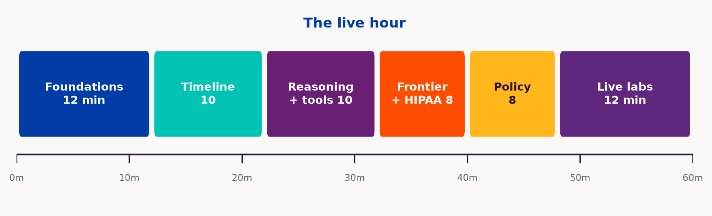{width="100%"}

::: notes
10-8-8-8-8-18. Q&A eats slack. Live labs are 1–4. Take-home is 5–8 in the handout. Do not read the 40-page packet.
:::

---

## Foundations {background-color="#003DA6" .section-break}

10 minutes

---

## AI is one word for three jobs {.viz}

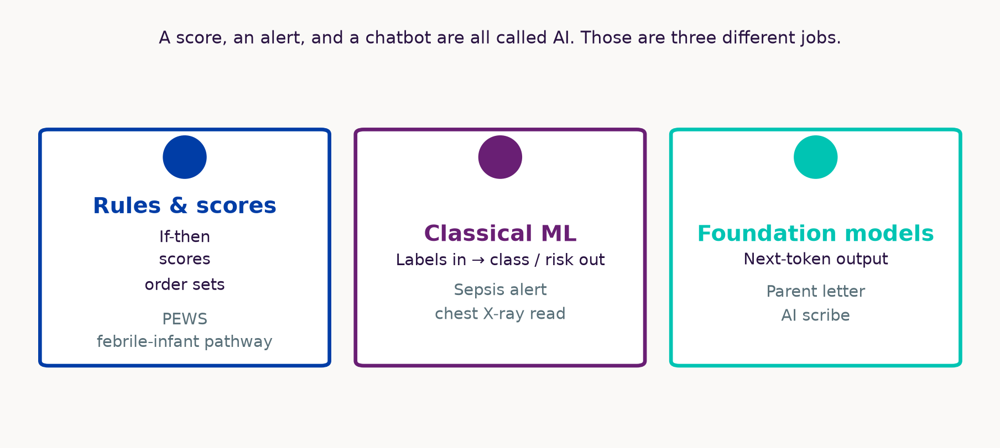{width="100%"}

::: notes
A score, an alert, and a chatbot are all called AI — that sentence is on the canvas so they do not need you. Rules / classical ML / foundation models. Left box is not “unlearned”: PEWS-style scores are often expert-weighted; neonatal sepsis rules were split out of data (sequential division). CAD on the middle card is computer-aided detection — a chest X-ray read. FDA does not regulate “AI as such”; it regulates devices by intended use.
:::

---

## How the model is taught {.viz}

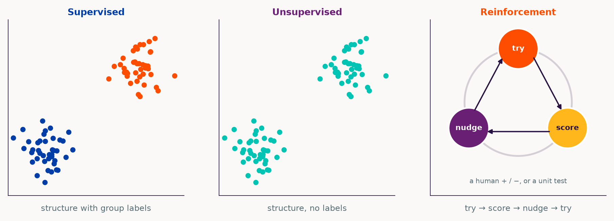{width="100%"}

::: notes
Same points in the first two panels. Supervised: x goes with y; the colors are group labels. Unsupervised: the colors are gone; the model only sees structure. Reinforcement is a roundabout: try an answer, get scored (a human +/−, or a unit test), nudge the weights, try again. LLMs are mostly self-supervised pretraining plus later alignment. Pediatric labels are often billing codes, not truth.
:::

---

## Adult accuracy, pediatric ward {.viz}

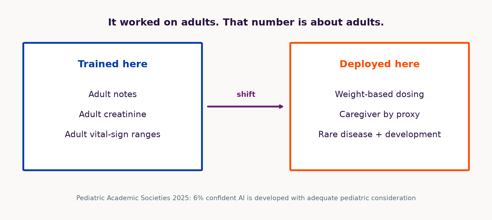{width="100%"}

::: notes
Distribution shift. Vendors often quote AUROC; say adult accuracy so they hear the population, not the metric. The 6% PAS number is a conference abstract. Carry it as a prior, not as a prevalence study.
:::

---

## Tokens, not letters {.viz}

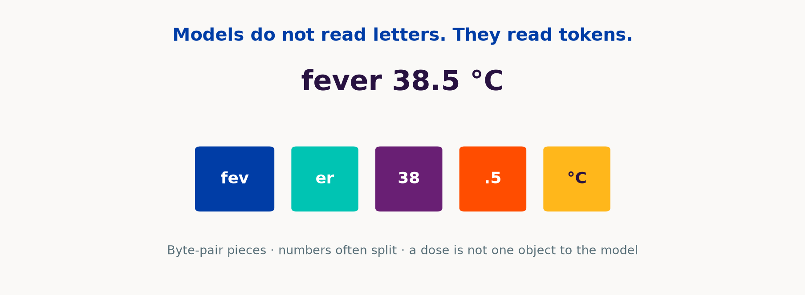{width="100%"}

::: notes
A dose is several tokens. That is why numeric hallucination is easy and why "just one number" is not a simple object inside the net.
:::

---

## The model guesses the next token {.viz}

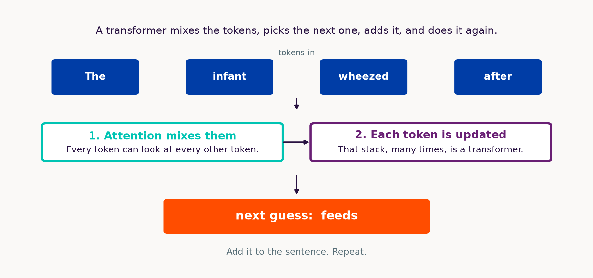{width="100%"}

::: notes
Decoder-style LLM: given the tokens so far, score the next one, add it, repeat. The mix-then-update stack is a transformer. Next slide zooms on the mix.
:::

---

## Attention {.viz}

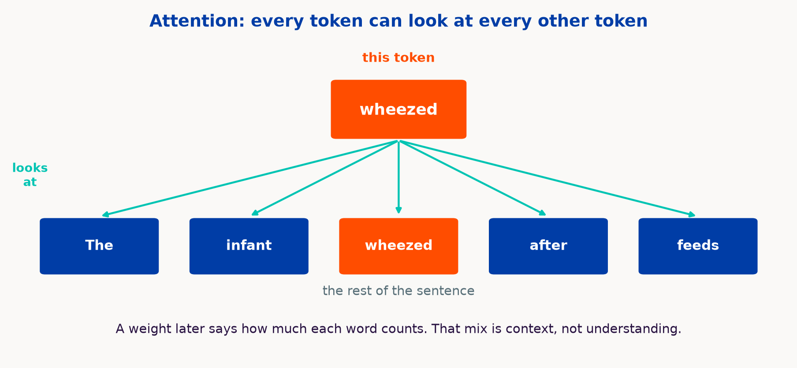{width="100%"}

::: notes
Self-attention, 2017. This is the mix step from the last slide. One token looking at the sentence. Point: context, not magic understanding.
:::

---

## Timeline {background-color="#00C4B3" .section-break}

8 minutes

---

## How we got here {.viz}

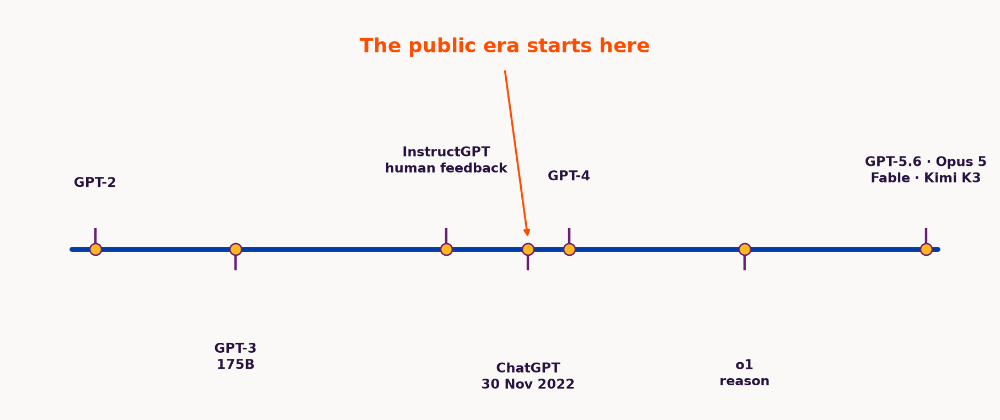{width="100%"}

::: notes
GPT-2 unsupervised. GPT-3 in-context. InstructGPT RLHF. ChatGPT Nov 2022 is the public rupture — point at that orange line, not a long arrow. GPT-4 multimodal. Llama 2 (Jul 2023) is why a laptop path exists. o1 Sep 2024 is test-time compute as a product. DeepSeek-R1 Jan 2025 is the public proof that reasoning-style RL was not OpenAI-only. 2026 names are access classes, not Elo to memorize.
:::

---

## Size and what still matters {.viz}

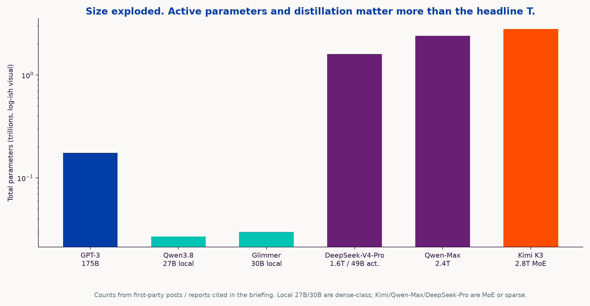{width="100%"}

::: notes
Mixture-of-experts vs dense. Laptop 27-billion and 30-billion models vs trillion-parameter datacenter models. Counts from first-party posts in the briefing. Do not treat the y-axis as quality.
:::

---

## Reasoning and tools {background-color="#691F74" .section-break}

8 minutes

---

## Retrieve, then generate {.viz}

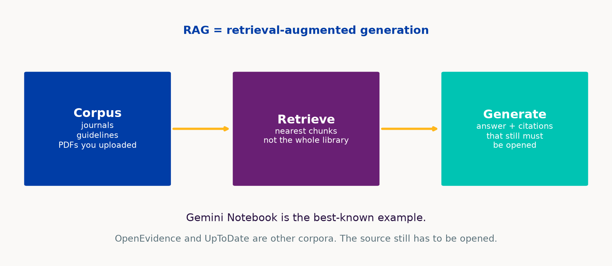{width="100%"}

::: notes
Retrieve then generate. Reduces some hallucinations. Does not stop wrong-paper, unsupported synthesis, leftover parametric claims, or citation theater.
:::

---

## Hallucinations changed shape {.viz}

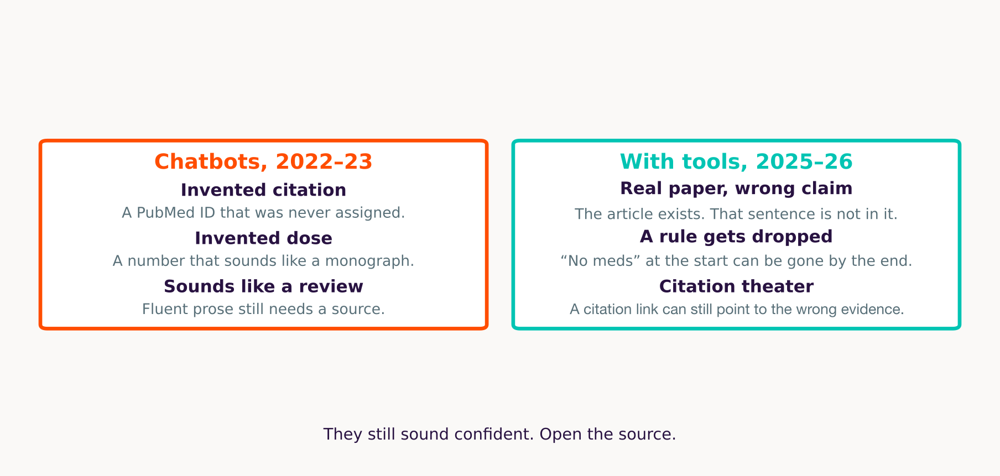{width="100%"}

::: notes
Old: invented PubMed ID. New: real paper, wrong claim; a rule set at the start can vanish mid-run; citation chips that look like proof. Artsi: interpretive error even with real citations.
:::

---

## Extra compute at answer time {.viz}

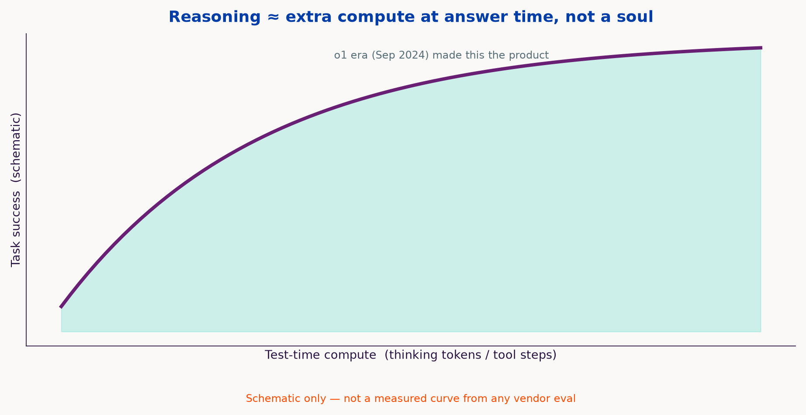{width="100%"}

::: notes
Not human reasoning. Try several answers at answer time and keep one that checks out. o1 (Sep 2024) made that the product. Coding evals moved because you can grade code. That pulled computer-use and harnesses.
:::

---

## Chat vs harness {.viz}

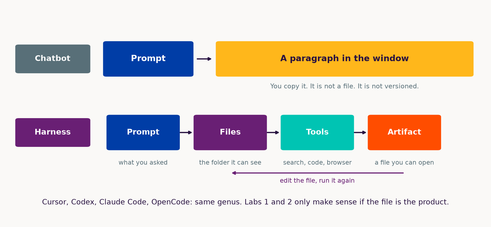{width="100%"}

::: notes
Top row is a chatbot: prompt in, a paragraph out, you copy it — nothing is a file. Bottom row is a harness: prompt, files it can see, tools (search, code, browser), an artifact you can open, then edit and run again. Cursor is one harness. Codex, Claude Code, OpenCode are the same genus. Point: Labs 1 and 2 only make sense if they believe the file is the product.
:::

---

## The exam and the ward {.viz}

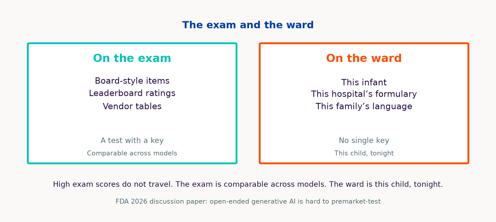{width="100%"}

::: notes
Board-style exams and vendor tables are a test with a key, comparable across models. This infant, this formulary, and this family’s language are not. High scores do not travel to weight-based dosing. FDA 2026 paper is still asking how to test open-ended generative AI.
:::

---

## Frontier and privacy {background-color="#FF4D00" .section-break}

8 minutes

---

## Three boxes {.viz}

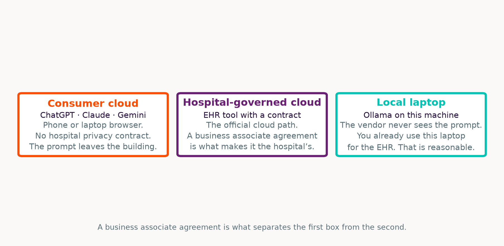{width="100%"}

::: notes
Phone = closed API, no BAA. Hospital EHR someday = governed box 1. Laptop = box 3, and that is a reasonable setup: the vendor never sees the prompt, and they already use that laptop for the EHR. Gemma 4 31B is Google’s current open-weight flagship in that hardware class (Apr 2026; 4-bit ~17.5 GB on Google’s card). Mythos is restricted — do not tell them to just use it.
:::

---

## 11 studies. Zero pediatric. {.align-end}

::: {.copy-block}
**Artsi et al., 2026** — independent systematic review of OpenEvidence. *npj Digital Medicine*, article-in-press.

- 11 studies, through January 2026
- None synthesized as pediatric
- Where measured, fewer invented citations than general chatbots
- More often reinforces a decision than changes it
- The product is still moving

Company line “>40% of US physicians daily” is vendor-reported.
:::

::: notes
Artsi 2026 OpenEvidence systematic review. Click citations. Reinforces rather than changes decisions. Company "40% of US physicians" is vendor-reported. Registry: PROSPERO CRD420261289103. Do not invent a pediatric evidence base from 11 adult-leaning studies.
:::

---

## Grounding and accuracy {.viz}

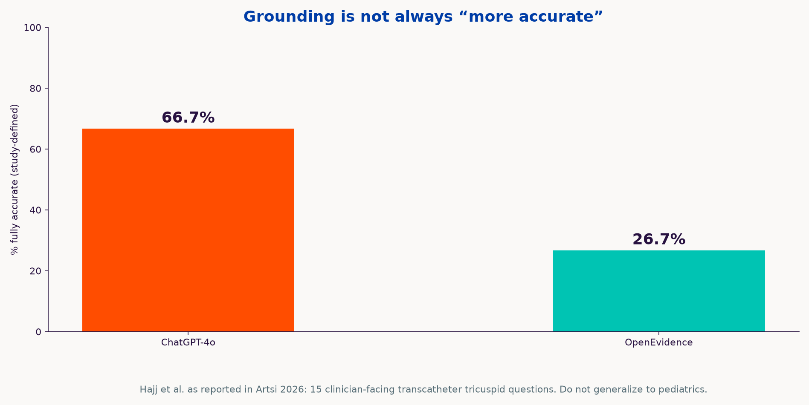{width="100%"}

::: notes
Hajj inside Artsi: ChatGPT-4o 66.7 vs OE 26.7 on 15 tricuspid questions. Do not over-read. Heuristic: OE for journals, UpToDate for the editorial corpus you already pay for, neither for "what do I do without looking."
:::

---

## Local models need memory {.viz .stack-viz}

{width="100%"}

::: {.viz-links}
[Ollama](https://ollama.com){target="_blank"} · [Hugging Face models](https://huggingface.co/models){target="_blank"}
:::

::: notes
Ollama qwen3.8 18 GB. Glimmer <20 GB 4-bit. 8–16 GB laptops run 8B-class, slowly. The 12 GB bar is the midpoint of that class. Hardware is the constraint. If it fits, local is a reasonable way to keep the prompt off a vendor. Click Ollama, then Hugging Face models, so they see where local weights live. Links open a new tab; the deck stays up.
:::

---

## Where the prompt goes {.viz}

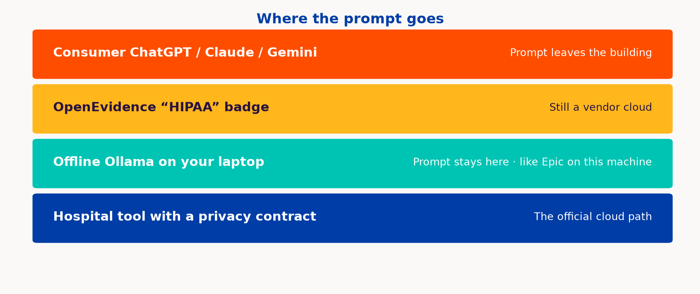{width="100%"}

::: notes
Consumer ChatGPT: the prompt leaves the building. OpenEvidence’s HIPAA badge is still a vendor cloud. Local Ollama: the prompt stays on the laptop they already use for the EHR. That is a reasonable path. Hospital BAA tools are the official cloud path.
:::

---

## Policy {background-color="#691F74" .section-break}

8 minutes

---

## They are already using it {.viz}

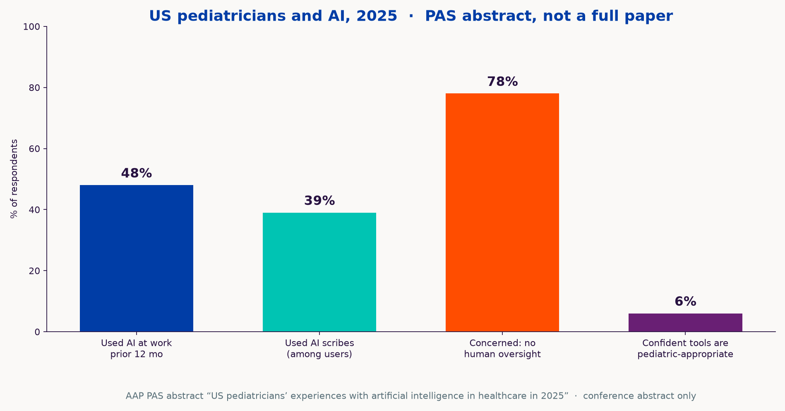{width="100%"}

::: notes
PAS 2025. Punchline is 6%.
:::

---

## 2026, on a line {.viz}

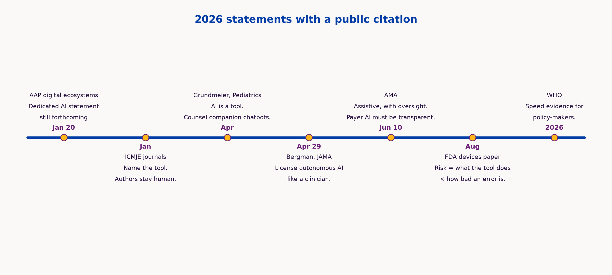{width="100%"}

::: notes
Walk left to right. AAP January: digital-ecosystems policy; the dedicated AI statement is still forthcoming — do not invent one. ICMJE January: name the tool, chatbots cannot be authors, humans stay accountable; Pediatrics follows this. Grundmeier April is a CHOP state-of-the-art review in Pediatrics: AI is a tool; counsel teens using companion chatbots; it is a review. Bergman JAMA Viewpoint: license autonomous clinical AI more like a clinician; opinion, not a statute. AMA 10 June: assistive, physician review of coverage denials, transparency when models change — this is the one they feel on prior-auth. FDA August: discussion paper, two-axis risk (what the tool does × how bad an error is), comments docket. WHO B09667: evidence-informed policy for policy-makers, not a pediatric practice guideline. No AAP clinical AI policy in this window.
:::

---

## Judge the work

::: {.kicker}
A position on journal AI rules
:::

::: {.judge-lede}
Evaluate the project on its merits. The manuscript carries the claims.
:::

:::: {.judge-grid}
::: {.box .box-orange .box-prose}
::: {.box-label}
Confession theater
:::

Naming the tools does not make the science more true. Grammar help and a fabricated table are different acts.
:::
::: {.box .box-purple .box-prose}
::: {.box-label}
The paper is the record
:::

A Slack thread with a colleague is not the paper. Prompts are that kind of working chat. Share the numbers, the code, and a citation you can open.
:::
::: {.box .box-teal .box-prose}
::: {.box-label}
Many tools, one paper
:::

A harness can call several models and tools. People switch for the job. Citing every hop is not a feasible methods section.
:::
::: {.box .box-blue .box-prose}
::: {.box-label}
Models in the pipeline
:::

Use LLMs for drafting, checking, review, and evaluation. Reviewers can use them to check claims.
:::
::: {.box .box-gold .box-prose}
::: {.box-label}
Taste stays human
:::

Importance stays with authors and reviewers. Models are tuned more for engineering than for scientific taste or creativity.
:::
::: {.box .box-web .box-prose}
::: {.box-label}
Pedantry is not the argument
:::

They stall on reproducibility theater — pedantic checks that do not carry the result. Those checks are not the scientific claim.
:::
::::

::: notes
ICMJE and Pediatrics still ask authors to name the tool and forbid chatbot authors. Say that once so they are not surprised at submission. Then the 3×2: naming the tools does no epistemic work; grammar help ≠ a fabricated table; a Slack thread with a colleague is not the paper, and neither is a prompt log — share numbers, code, and a citation you can open; a session may have used Cursor plus two models plus a browser tool — listing every hop is not a methods standard; let models into review as checkers; keep importance with people; LLMs are tuned more for engineering than for scientific taste, so they get stuck on pedantic reproducibility theater that does not carry the scientific claim. An adult creatinine in a pediatrics manuscript is a scientific failure, not a missing disclosure checkbox. This is a position, not a journal’s current rulebook.
:::

---

## Live labs {background-color="#5F277E" .section-break}

18 minutes

---

## This hour vs take-home

::: {.kicker}
Live hour is Labs 1–4, in order. Labs 5–8 are take-home. Each slide is the recipe.
:::

:::: {.lab-catalog}
::: {.box .box-web}
::: {.box-label}
This hour · Labs 1–4
:::

::: {.lab-row}
::: {.lab-num}
1
:::
::: {.lab-row-text}
Files from a harness

Word, Excel, slides from a stem we wrote
:::
:::

::: {.lab-row}
::: {.lab-num}
2
:::
::: {.lab-row-text}
Audit the dose sheet

Fictional teachicillin. Formula view.
:::
:::

::: {.lab-row}
::: {.lab-num}
3
:::
::: {.lab-row-text}
One question, three corpora

Same febrile-infant question
:::
:::

::: {.lab-row}
::: {.lab-num}
4
:::
::: {.lab-row-text}
Citation autopsy

Open PubMed on the first three IDs
:::
:::

::: {.lab-catalog-foot}
Cursor, then the browser. You watch. Repeat later on the free path.
:::
:::
::: {.box .box-teal}
::: {.box-label}
Take-home · Labs 5–8
:::

::: {.lab-row}
::: {.lab-num}
5
:::
::: {.lab-row-text}
GitHub Pages journal club

Markdown → a URL that works on a phone
:::
:::

::: {.lab-row}
::: {.lab-num}
6
:::
::: {.lab-row-text}
Local model on your laptop

Ollama, airplane mode
:::
:::

::: {.lab-row}
::: {.lab-num}
7
:::
::: {.lab-row-text}
Harness loop vs chatbot

Same request. Files vs a paragraph.
:::
:::

::: {.lab-row}
::: {.lab-num}
8
:::
::: {.lab-row-text}
Gemini Notebook

Your PDFs. Grounded Q&A.
:::
:::

::: {.lab-catalog-foot}
Recipes on the next slides. Free path for each.
:::
:::
::::

::: notes
Walk the two columns in order. Labs 1–2 Cursor, 3–4 browser. Do not run 5–8 live. Fallback Python if the agent dies.
:::

---

## Lab 1 — files, not paragraphs

::: {.kicker}
Live · 1 of 4 · Cursor
:::

::: {.lab-goal}
Goal: one synthetic stem in a file becomes Word, Excel, and PowerPoint you can open. A chatbot would return three paragraphs. The harness should return three files. That is the whole point.
:::

:::: {.lab-split}
::: {.box .box-purple .box-prose}
::: {.box-label}
STEM.md — we wrote this
:::

Not model output. We wrote it so the agent has a bounded case and cannot “helpfully” add identifiers, meds, or invented PubMed IDs.

**What it says.** 6-month-old former 36-week infant, day 2 of RSV bronchiolitis. SpO2 nadir 88% on room air, now 94% on 0.5 L NC. Taking 50% of feeds. Family wants a plain-language update. Night team wants a wean tracker.
:::
::: {.box .box-teal .box-prose}
::: {.box-label}
How · empty folder, STEM.md already in it
:::

Paste in Cursor Agent:

Read STEM.md. Create family_update.docx, oxygen_wean_tracker.xlsx, noon_conference.pptx from that stem only. No identifiers. No medication column. No invented PubMed IDs. End the letter with “this is a teaching example.”

**At home, no Cursor.** `pip install python-docx openpyxl python-pptx` then `python slides/workshops/lab1_fallback.py`. Or ask ChatGPT for a Python script and run it locally.
:::
::::

::: {.lab-done}
Done when three files open, the tracker has no meds, and the letter ends with the teaching line. Optional sting: same stem in ChatGPT, “add a dexamethasone dose” — it will often invent a number; the spreadsheet has no meds on purpose.
:::

::: notes
Paste. Open the three files. Residents can repeat with the fallback script. Do not live-compose the prompt.
:::

---

## Lab 2 — audit the dose sheet

::: {.kicker}
Live · 2 of 4 · same Cursor window, new folder
:::

::: {.lab-goal}
Goal: the model writes Excel that looks official. You audit formulas, not the pretty numbers. Fictional drug only.
:::

:::: {.lab-split}
::: {.box .box-orange .box-prose}
::: {.box-label}
KEY.md — we wrote this too
:::

The key is the answer sheet, written by us, not a model. It exists so “correct” is defined before the agent runs.

**Rules.** `teachicillin`, oral, 10 mg/kg/dose every 8 hours, max 400 mg/dose. Weight under 2 kg → TOO_SMALL. Age is recorded; it does not change the dose.
:::
::: {.box .box-teal .box-prose}
::: {.box-label}
How · paste in Cursor Agent
:::

Read KEY.md. Create dosing.xlsx from those rules only. If KEY.md is silent, write CHECK_KEY. Add a README.

Then flip to formula view. Hunt: missing max, mg vs mcg, adult default, invented frequency.

**At home.** `python slides/workshops/lab2_fallback.py` — that sheet omits the 400 mg cap on purpose so you still have something to catch.
:::
::::

::: {.lab-done}
Done when formula view is on the projector and the room has named at least one error. Repeat later with any made-up key you write yourself.
:::

::: notes
KEY.md already in the folder. Fallback is wrong on purpose.
:::

---

## Lab 3 — one question, three corpora

::: {.kicker}
Live · 3 of 4 · browser
:::

::: {.lab-goal}
Goal: the same pediatric question, three sources. Retrieve-then-generate is a corpus choice. Score what you would actually act on.
:::

::: {.lab-prompt}
Previously healthy 8-week-old, 38.5 °C, well-appearing. Current AAP guidance on lumbar puncture? Quote the document. If you cannot quote, say so.
:::

:::: {.lab-arms}
::: {.box .box-orange .box-prose}
::: {.box-label}
A · ChatGPT
:::

Search **off**. Parameters only. Demand a PMID. Try to open it.
:::
::: {.box .box-purple .box-prose}
::: {.box-label}
B · Gemini Notebook
:::

One public AAP or CDC PDF you uploaded. Require a quote. Click the chip.
:::
::: {.box .box-teal .box-prose}
::: {.box-label}
C · OpenEvidence
:::

Licensed journals, if your NPI works. Click through. If blocked, B is enough.
:::
::::

::: {.lab-done}
Whiteboard: quoted? clickable? pediatric? would I act? Arm A often mashups febrile-infant algorithms. Repeat tonight with any public guideline PDF you are allowed to upload.
:::

::: notes
Stay in the browser for Labs 3 and 4. If OpenEvidence is blocked, skip C without apology.
:::

---

## Lab 4 — citation autopsy

::: {.kicker}
Live · 4 of 4 · same ChatGPT tab, search still off
:::

::: {.lab-goal}
Goal: fluent references still need a click. The sting is one dead or mismatched identifier, not a perfect eight.
:::

::: {.lab-prompt}
Eight Vancouver-style references on high-flow vs CPAP for bronchiolitis, 2018–2026. Include PubMed IDs.
:::

::: {.lab-steps}
1. Open PubMed.
2. Search the first three IDs only.
3. Mark each: exists / exists but the wrong paper / does not exist.
4. Stop. Do not chase all eight.
:::

::: {.lab-done}
Grounded mode still needs a click — say that if there is time. Repeat at home with any topic you already know. Then go to take-home Labs 5–8; do not run them in this hour.
:::

::: notes
Paste. Open PubMed. One miss is the teaching point. Then stop. Do not run Labs 5–8 live.
:::

---

## Take-home labs {background-color="#00C4B3" .section-break}

The slides are the recipe

---

## Lab 5 — journal club on a URL

::: {.kicker}
Take-home · 5 of 8 · GitHub Pages
:::

::: {.lab-goal}
Goal: Markdown (or HTML) journal-club slides become a link that works on a phone. Versioned teaching beats emailing `final_v7.pptx`.
:::

::: {.lab-steps}
**What you need.** One published open paper or open guideline (not a paywalled PDF you do not have rights to post). A GitHub account, or just a zip of `index.html`.

**How.**

1. Empty folder. Put notes from the paper in `PAPER.md`.
2. Ask a harness — or ChatGPT for HTML — for eight Reveal (or similar) slides in `docs/index.html`. MIT license. README: teaching fork.
3. `git init`, new public repo, push. Settings → Pages → deploy from `main` / `docs`.
4. Open the URL on your phone.

**If GitHub is blocked.** Zip `index.html` and open it locally. The lesson is static hosting, not a particular site.
:::

::: {.lab-done}
Done when the link (or the local file) opens on a phone. Do not enable Pages until citations are verified — Lab 4 still applies on a public URL.
:::

::: notes
Do not run live. Point at the slide. Handout Workshop 2 is the long recipe.
:::

---

## Lab 6 — local model, airplane mode

::: {.kicker}
Take-home · 6 of 8 · Ollama
:::

::: {.lab-goal}
Goal: summarize a synthetic H&P with the network off. The vendor never sees the prompt.
:::

::: {.lab-steps}
**What fits.** 8–16 GB laptop: 8B-class, slowly. 24–32 GB box: Qwen3.8-27B, Muse Glimmer 30B, or Gemma 4 31B (4-bit ~17.5 GB).

**How.**

1. Install [ollama.com](https://ollama.com). `ollama pull qwen3.8` or `ollama pull qwen3:8b` if memory is tight.
2. Airplane mode. Confirm Wi-Fi is off.
3. Paste a synthetic H&P.
4. Prompt: list problems, overnight contingencies, three questions for the family. Do not invent labs. If a value is missing, say MISSING.

**Then, while online.** Paste the same synthetic note into consumer ChatGPT. That is the vendor you do not have a contract with.
:::

::: {.lab-done}
Done when Wi-Fi is off the whole time and the model still answers.
:::

::: notes
Hardware honesty before anyone tries 27B on 8 GB. Gemma 4 31B is the Google open-weight flagship in this class.
:::

---

## Lab 7 — harness loop vs chatbot

::: {.kicker}
Take-home · 7 of 8 · files vs a paragraph
:::

::: {.lab-goal}
Goal: the same request in ChatGPT and in a harness. The product you want is the loop (files, tools, a check), not the chat box.
:::

::: {.lab-prompt}
In an empty folder, create a single `index.html` that plots WHO-style weight-for-age synthetic curves for 0–24 months and lets me type a weight to see a labeled teaching z-score using an explicit formula in a comment. No external APIs. Then confirm the file opens.
:::

::: {.lab-steps}
1. **Arm A · ChatGPT.** Paste the request. Try to copy files by hand. Notice where you stall (“where do I put this”).
2. **Arm B · harness.** Cursor, Codex, Claude Code, or OpenCode + Ollama in an empty folder. Same request. Let it write and open the file.
3. Open `index.html` in a browser.
:::

::: {.lab-done}
Done when the harness file opens. Paid Cursor is optional; OpenCode + a local model is the free echo.
:::

::: notes
Do not run live. Ties back to the chatbot-vs-harness figure.
:::

---

## Lab 8 — Gemini Notebook

::: {.kicker}
Take-home · 8 of 8 · your PDFs
:::

::: {.lab-goal}
Goal: grounded Q&A over files you chose. Right tool for journal club and policy. Wrong tool for the census.
:::

::: {.lab-steps}
**What to upload (public only).** AAP digital-ecosystems policy. Grundmeier 2026 *Pediatrics* review. ICMJE Recommendations. Artsi 2026 OpenEvidence review. Optional: a CDC/AAP open bronchiolitis PDF.

**How.**

1. New Gemini Notebook. Upload only those files.
2. Ask: what does AAP say it is **not** covering regarding AI? (Dedicated AI statement still forthcoming.) Contrast Grundmeier: useful counseling review, not that policy.
3. Ask a question **outside** the corpus. The right behavior is refusal or “not in sources.”
4. Click every citation chip. Optional: audio overview for a commute.
:::

::: {.lab-done}
Done when a chip opens *your* PDF, and an off-corpus question is declined. NotebookLM was renamed Gemini Notebook (16 Jul 2026).
:::

::: notes
Public papers only. Do not upload real notes.
:::

---

## Six things to leave with {.viz}

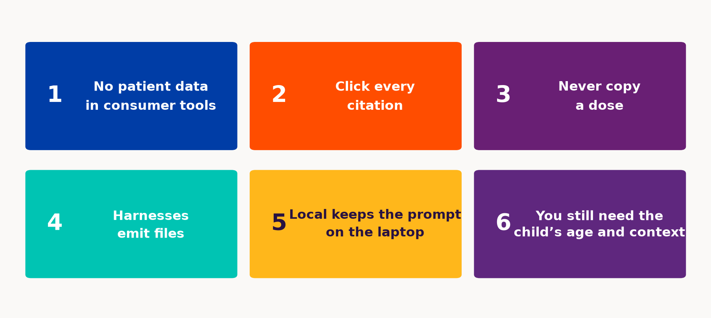{width="100%"}

::: notes
Repeat. Point at the briefing packet and workshops.md. Pocket card is in the briefing appendix if you printed it.
:::

---

## Questions {background-color="#003DA6" .section-break}

::: notes
Stop. Do not invent an AAP clinical AI guideline in Q&A. Packet is briefing/; presenter-kit is slides/presenter-kit.md. Train mark is BSW/McLane, internal teaching use.
:::
