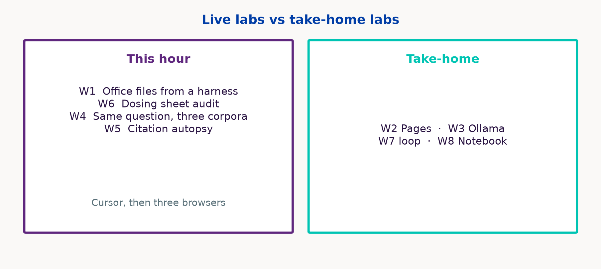

---
format:
  revealjs:
    theme: [simple, mclane.scss]
    slide-level: 2
    slide-number: c/t
    show-slide-number: all
    hash-type: number
    width: 1280
    height: 720
    margin: 0.05
    logo: assets/mclane-train.svg
    footer: "BSW McLane Children's"
    embed-resources: true
    navigation-mode: linear
    controls-tutorial: false
    preview-links: false
    chalkboard: false
    progress: true
    html-math-method: katex
    code-overflow: wrap
    fig-align: center
---

## {background-color="#FAF9F7"}

{width="70%"}

::: {.kicker}
Pediatric residency workshop-lecture · Temple
:::

::: {.deck-title}
A survey of modern AI
:::

Teaching survey · invented cases

::: notes
Open on the train. This is McLane's mark from the hospital site, not clip-art. Say: one hour, two live labs, a written briefing for everything we skip. No PHI tonight. This is a survey, not a protocol and not patient-specific direction — keep that in your voice, not as a punch on the title slide.
:::

---

## Three rules for this hour

:::: {.columns}
::: {.column width="32%"}
::: {.box .box-orange}
### Invented cases

Every demo patient is made up.
:::
:::
::: {.column width="32%"}
::: {.box .box-purple}
### No real notes in ChatGPT

Consumer ChatGPT, Claude, Gemini.

No names, record numbers, or pasted notes.
:::
:::
::: {.column width="32%"}
::: {.box .box-teal}
### Check before you copy

A dose or a citation from a model stays out of the note until the source is open.
:::
:::
::::

::: notes
Three of the five briefing rules, in English. If someone offers a real H&P, stop and point at card 1. Consumer cloud is the problem. Local models wait for the prompt-goes-where slide.
:::

---

## The live hour {.viz}

{width="100%"}

::: notes
10-8-8-8-8-18. Q&A eats slack. Handout has four more workshops. Do not read the 40-page packet.
:::

---

## Foundations {background-color="#003DA6" .section-break}

10 minutes

---

## Same word. Three jobs. {.viz}

{width="100%"}

::: notes
Rules / classical ML / foundation models. Left box is not “unlearned”: PEWS-style scores are often expert-weighted; neonatal sepsis rules were split out of data (sequential division). CAD on the middle card is computer-aided detection — a chest X-ray read. FDA does not regulate “AI as such”; it regulates devices by intended use.
:::

---

## How the model is taught {.viz}

{width="100%"}

::: notes
Same points in the first two panels. Supervised: the colors are the labels. Unsupervised: the colors are gone; the model only sees structure. RL: reward. LLMs are mostly self-supervised pretraining plus later alignment. Pediatric labels are often billing codes, not truth.
:::

---

## Adult metrics, pediatric ward {.viz}

{width="100%"}

::: notes
Distribution shift. The 6% PAS number is a conference abstract. Carry it as a prior, not as a prevalence study.
:::

---

## Tokens, not letters {.viz}

{width="100%"}

::: notes
A dose is several tokens. That is why numeric hallucination is easy and why "just one number" is not a simple object inside the net.
:::

---

## Attention {.viz}

{width="100%"}

::: notes
Self-attention, 2017. Cartoon: one token looking at the sentence with straight arrows. Not a measured attention head. Point: context, not magic understanding.
:::

---

## Timeline {background-color="#00C4B3" .section-break}

8 minutes

---

## How we got here {.viz}

{width="100%"}

::: notes
GPT-2 unsupervised. GPT-3 in-context. InstructGPT RLHF. ChatGPT 30 Nov 2022 is the public rupture. GPT-4 multimodal. o1 Sep 2024 is test-time compute as a product. 2026 names are access classes, not Elo to memorize.
:::

---

## Size and what still matters {.viz}

{width="100%"}

::: notes
Mixture-of-experts vs dense. Laptop 27-billion and 30-billion models vs trillion-parameter datacenter models. Counts from first-party posts in the briefing. Do not treat the y-axis as quality.
:::

---

## Reasoning and tools {background-color="#691F74" .section-break}

8 minutes

---

## Retrieve, then generate {.viz}

{width="100%"}

::: notes
Retrieve then generate. Reduces some hallucinations. Does not stop wrong-paper, unsupported synthesis, leftover parametric claims, or citation theater.
:::

---

## Hallucinations changed shape {.viz}

{width="100%"}

::: notes
Old: invented PubMed ID. New: real paper, wrong claim; a rule set at the start can vanish mid-run; citation chips that look like proof. Artsi: interpretive error even with real citations.
:::

---

## Extra compute at answer time {.viz}

{width="100%"}

::: notes
Not human reasoning. Sample candidates, check them, spend more tokens at answer time. o1 (Sep 2024) made that the product. Coding evals moved because you can grade code. That pulled computer-use and harnesses. The curve is a cartoon, not a vendor eval.
:::

---

## Chat vs harness {.viz}

{width="100%"}

::: notes
MCP, skills, orchestration — USB-C to tools, reusable instruction folders, a loop that writes files. Cursor is one harness. Codex is the same genus.
:::

---

## The exam and the ward {.viz}

{width="100%"}

::: notes
Board-style exams and vendor tables are one kind of test. This infant, this formulary, and this family’s language are another. FDA 2026 paper is still asking how to test open-ended generative AI.
:::

---

## Frontier and privacy {background-color="#FF4D00" .section-break}

8 minutes

---

## Three boxes {.viz}

{width="100%"}

::: notes
Phone = closed API, no BAA. Hospital EHR someday = governed box 1. Laptop = box 3, and that is a reasonable setup: the vendor never sees the prompt, and they already use that laptop for the EHR. GLM-5.3 weights not public. Mythos is restricted — do not tell them to just use it.
:::

---

## 11 studies. Zero pediatric.

**Artsi et al., 2026** — independent systematic review of OpenEvidence. *npj Digital Medicine*, article-in-press.

- 11 studies, through January 2026
- None synthesized as pediatric
- Where measured, fewer invented citations than general chatbots
- More often reinforces a decision than changes it
- The product is still moving

Company line “>40% of US physicians daily” is vendor-reported.

::: notes
Artsi 2026 OpenEvidence systematic review. Click citations. Reinforces rather than changes decisions. Company "40% of US physicians" is vendor-reported. Registry: PROSPERO CRD420261289103. Do not invent a pediatric evidence base from 11 adult-leaning studies.
:::

---

## Grounding and accuracy {.viz}

{width="100%"}

::: notes
Hajj inside Artsi: ChatGPT-4o 66.7 vs OE 26.7 on 15 tricuspid questions. Do not over-read. Heuristic: OE for journals, UpToDate for the editorial corpus you already pay for, neither for "what do I do without looking."
:::

---

## Local models need memory {.viz}

{width="100%"}

::: notes
Ollama qwen3.8 18 GB. Glimmer <20 GB 4-bit. 8–16 GB laptops run 8B-class, slowly. The 12 GB bar is the midpoint of that class. Hardware is the constraint. If it fits, local is a reasonable way to keep the prompt off a vendor.
:::

---

## Where the prompt goes {.viz}

{width="100%"}

::: notes
Consumer ChatGPT: the prompt leaves the building. OpenEvidence’s HIPAA badge is still a vendor cloud. Local Ollama: the prompt stays on the laptop they already use for the EHR. That is a reasonable path. Hospital BAA tools are the official cloud path.
:::

---

## Policy {background-color="#691F74" .section-break}

8 minutes

---

## They are already using it {.viz}

{width="100%"}

::: notes
PAS 2025. Punchline is 6%.
:::

---

## 2026, on a line {.viz}

{width="100%"}

::: notes
Walk left to right. AAP January: digital-ecosystems policy; the dedicated AI statement is still forthcoming — do not invent one. ICMJE January: name the tool, chatbots cannot be authors, humans stay accountable; Pediatrics follows this. Grundmeier April is a CHOP state-of-the-art review in Pediatrics: AI is a tool; counsel teens using companion chatbots; it is a review. Bergman JAMA Viewpoint: license autonomous clinical AI more like a clinician; opinion, not a statute. AMA 10 June: assistive, physician review of coverage denials, transparency when models change — this is the one they feel on prior-auth. FDA August: discussion paper, two-axis risk (what the tool does × how bad an error is), comments docket. WHO B09667: evidence-informed policy for policy-makers, not a pediatric practice guideline. No AAP clinical AI policy in this window.
:::

---

## Judge the work

::: {.kicker}
A position on journal AI rules
:::

::: {.judge-lede}
Evaluate the project on its merits. The manuscript carries the claims.
:::

:::: {.judge-grid}
::: {.box .box-orange .box-prose}
::: {.box-label}
Confession theater
:::

Naming the product does not make the science more true. Grammar help and a fabricated table are different acts.
:::
::: {.box .box-purple .box-prose}
::: {.box-label}
The paper is the record
:::

We do not archive the Slack thread with a postdoc. Same for prompts. Share numbers, code, and the citation you can open. A model-written sheet is a method.
:::
::: {.box .box-teal .box-prose}
::: {.box-label}
Models in the pipeline
:::

Use LLMs for drafting, checking, review, and evaluation. Reviewers can use them to check claims.
:::
::: {.box .box-blue .box-prose}
::: {.box-label}
Taste stays human
:::

Scientific importance and taste stay with authors, editors, and reviewers. Pediatric fit is a scientific claim.
:::
::::

::: notes
ICMJE and Pediatrics still ask authors to name the tool and forbid chatbot authors. Say that once so they are not surprised at submission. Then this 2×2: disclosure-as-stigma does no epistemic work; grammar help ≠ a fabricated table; we do not archive conversations with postdocs; the checkable artifacts are the paper (numbers, code, opened citations); a harness that emits a spreadsheet is a method — audit the file; let models into review and evaluation as checkers; keep importance and taste with people. An adult creatinine in a pediatrics manuscript is a scientific failure, not a missing disclosure checkbox. This is a position, not a journal’s current rulebook.
:::

---

## Live labs {background-color="#5F277E" .section-break}

18 minutes

---

## This hour vs take-home {.viz}

{width="100%"}

::: notes
W1 and W6 in Cursor. W4 and W5 in the browser. Fallback Python if the agent dies. Residents watch; free paths are in the handout.
:::

---

## Lab 1 — files, not paragraphs

::: {.kicker}
A model that writes files, not paragraphs
:::

```text
Read STEM.md.
Create family_update.docx, oxygen_wean_tracker.xlsx,
noon_conference.pptx from that stem only.
No identifiers. No medication column. No invented PubMed IDs.
```

::: notes
Leave this slide up. Empty folder; STEM.md already written. Paste the prompt. Open the three files. If the agent hangs: python slides/workshops/w1_fallback.py. Sting: chatbot "add dexamethasone dose." Spreadsheet has no meds on purpose.
:::

---

## Lab 6 — audit the dose sheet

::: {.kicker}
Pretty spreadsheet. Fictional drug. Find the error.
:::

```text
Read KEY.md.
Create dosing.xlsx from those rules only.
If KEY.md is silent, write CHECK_KEY.
Add a README: not for clinical use.
```

::: notes
Same Cursor window, new empty folder with KEY.md already there. Then formula view. Look for missing max, mg vs mcg, adult default, invented frequency. If the agent hangs: python slides/workshops/w6_fallback.py — that sheet is missing the 400 mg cap on purpose. Fictional teachicillin only. No live administration.
:::

---

## Lab 4 — one question, three corpora

::: {.kicker}
Same question. Three sources.
:::

> Previously healthy 8-week-old, 38.5 °C, well-appearing. Current AAP guidance on lumbar puncture? **Quote the document.** If you cannot quote, say so.

| A | B | C |
|---|---|---|
| ChatGPT, search **off** | Gemini Notebook + one public PDF | OpenEvidence |

::: notes
Arm A often mashups febrile-infant algorithms. Click every chip. If OpenEvidence is blocked, B is enough.
:::

---

## Lab 5 — citation autopsy

::: {.kicker}
Fluent references. Open PubMed.
:::

> Eight Vancouver-style references on high-flow vs CPAP for bronchiolitis, 2018–2026. Include PubMed IDs.

Mark the first three: exists / wrong paper / does not exist.

::: notes
Stay on ChatGPT, search off — same tab as Lab 4 arm A. Paste the prompt. Open PubMed on the first three IDs. One dead or mismatched identifier is the sting. Do not need all eight. Grounded mode still needs a click; say that if there is time.
:::

---

## Six things to leave with {.viz}

{width="100%"}

::: notes
Repeat. Point at the briefing packet and workshops.md. Pocket card is in the briefing appendix if you printed it.
:::

---

## Questions {background-color="#003DA6" .section-break}

:::: {.columns}
::: {.column width="42%"}
{width="100%"}
:::
::: {.column width="58%"}
Questions
:::
::::

::: notes
Stop. Do not invent an AAP clinical AI guideline in Q&A. Packet is briefing/; presenter-kit is slides/presenter-kit.md. Train mark is BSW/McLane, internal teaching use.
:::
